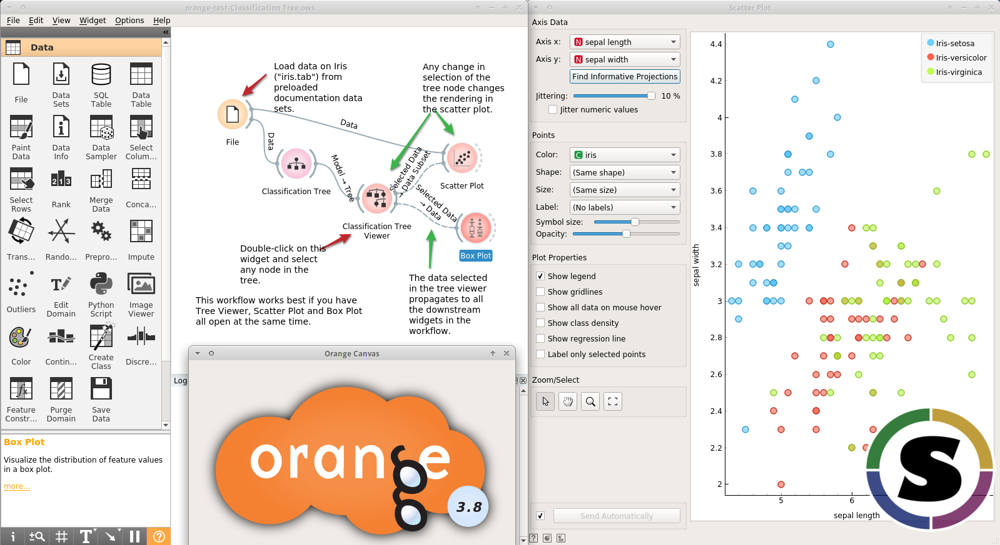

biolab-orange
*************

singularity container for the orange data mining tool from https://orange.biolab.si

To run::

	singularity pull shub://tin6150/biolab-orange
	./tin6150-biolab-orange-master-latest.simg

Container is based on Ubuntu 16.04 from Docker Hub.
(Could not use Anaconda image as that seems to lack graphics driver and fonts to properly display the GUI tool)
Also contain firefox so that helps and tutorials can be displayed.

Resulting Singularity image is about 4.5 GB (1.5 GB compressed).

Ref: 

- https://www.singularity-hub.org/collections/323
- https://github.com/tin6150/biolab-orange

~~~~

Dev/Build instructions 

.. code:: bash

	SING_VER=2.4.1
	module load container/singularity/${SING_VER}
	Singularity=$( which singularity )
	sudo    $Singularity build -w ./biolab-orange.simg ./Singularity
	-or-
	mkdir ./sandbox
	sudo    $Singularity build --sandbox ./sandbox ./Singularity

